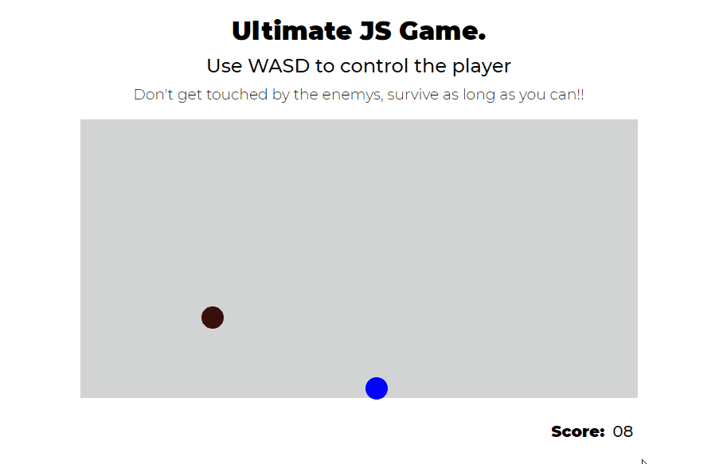
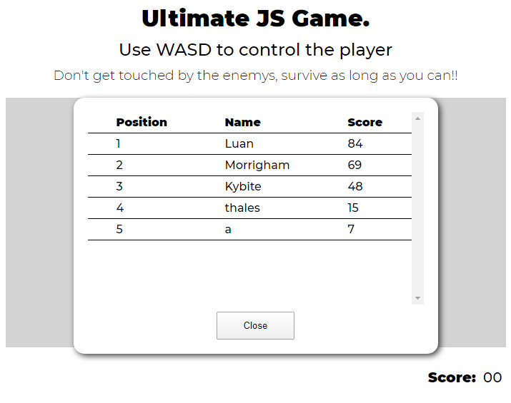

# Ultimate Javascript Game

A simple game made without any library, just javascript, to perfect my skills and fundamentals

To play open http://nyfts.github.io/  
  
Avoid the enemys (circles of red tones)  
Catch the powerups (green circles)  

## Scoreboard

There is a simple API developed in .NET core for the score system, named ScoreJs.API, and has its own repository in https://github.com/Nyfts/ScoreJs.API.

To make it work, just open the file ".\ScoreJs.API\startServer.bat"